# ContaFinanceira
API Rest em .Net Core 5.0 para abertura de conta financeira para pessoa física e ou jurídica utilizando banco de dados SQLServer.

## Estrutura de Pastas da Solução
| **Pasta** | **Descrição** |
| :---: | :---: |
| **ContaFinanceira.API** | Contém os controllers da aplicação e configurações da aplicação (injeções de dependência, Cors, etc) |
| **ContaFinanceira.Application** | Contém todos os serviços e validações do projeto, utilizados pelos controllers |
| **ContaFinanceira.Domain** | Contém todas as entidades (de base de dados), requests, responses, enumns e interfaces do projeto |
| **ContaFinanceira.Persistance** | Contém a camada de conexão com o banco de dados, com contexto e repositórios |
| **ContaFinanceira.Tests** | Contém todos os testes unitários dos controllers, services e repositórios do projeto |
| **ContaFinanceira.Util** | Contém itens úteis para execução dos serviços de Application, como criptografia |

## Recursos

A ContaFinanceira disponibiliza uma API Rest com os seguintes recursos:
- [**Agências**](#agências)
- [**Clientes**](#clientes)
- [**Contas**](#contas)
- [**Tipos Pessoas**](#tipos-pessoas)
- [**Transações**](#transações)
- [**Ordem de Execução das Chamadas**](#ordem-de-execução-das-chamadas)

Saiba mais sobre [**como utilizar a aplicação**](#como-utilizar-a-aplicação) e [**como testá-la**](#como-testar-a-aplicação)

# Agências
Listagem de agências bancárias disponíveis.
Necessário informar a agência na criação de conta.
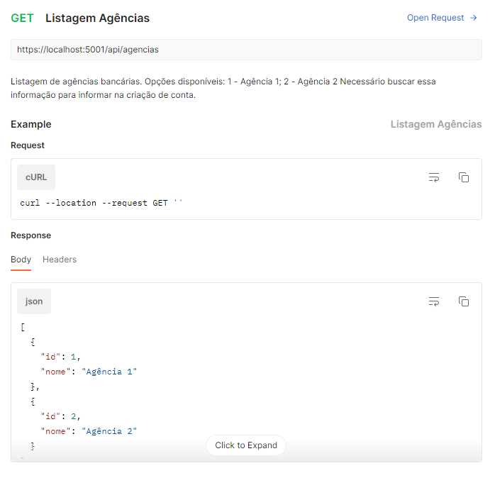

# Clientes
Autenticação de usuários na plataforma.
Para um usuário se autenticar é preciso, primeiro, criar uma nova conta para ele.
A autenticação é necessária para realizar qualquer tipo de transação (saque ou depósito).
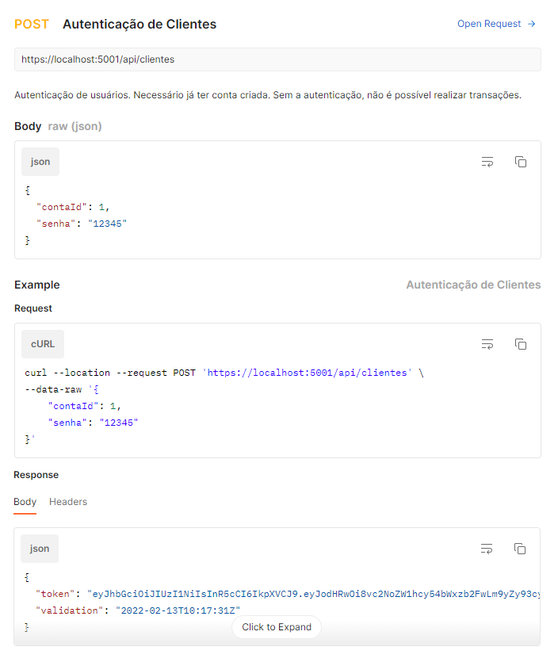

# Contas
Criação de nova conta bancária para pessoa física ou jurídica.
Caso deseje, no momento da abertura da conta, o usuário pode fazer um depósito inicial.
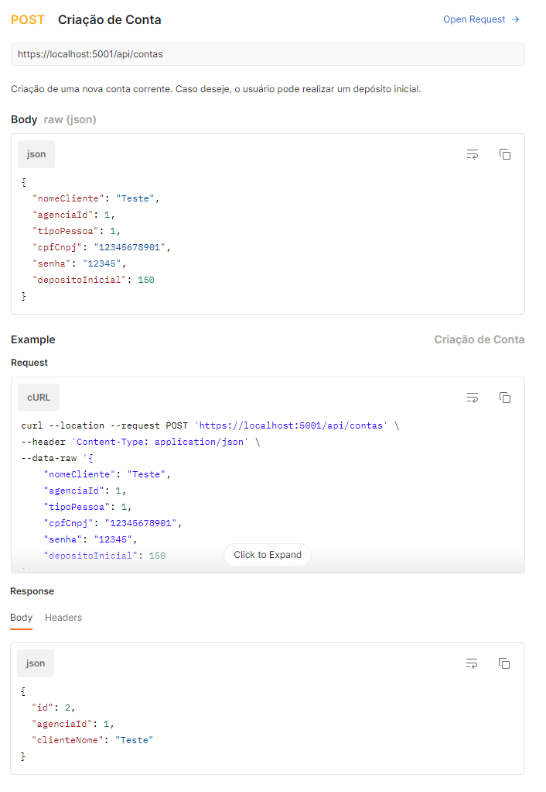

# Tipos Pessoas
Listagem de tipos de pessoas disponíveis.
Necessário informar a agência na criação de conta.
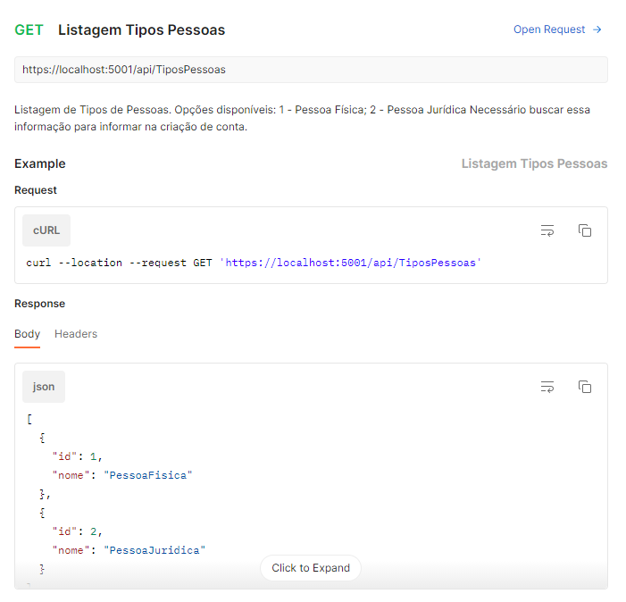

# Transações
Realização de uma determinada transação na conta, seja ela um saque ou um depósito.
Necessário já ter uma conta criada e estar autenticado na plataforma.
Caso o usuário deseje fazer um saque, o saldo da conta precisa ser verificado.
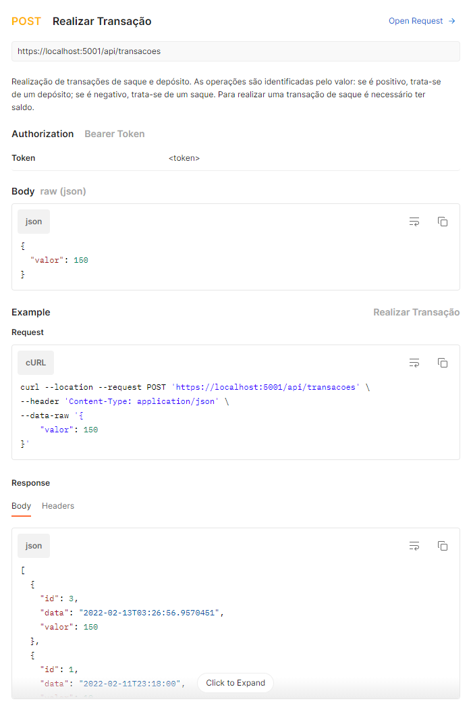

# Ordem de Execução das Chamadas
Para o funcionamento ideal da aplicação é necessário seguir uma determinada ordem de execução nas chamadas.

1. Antes de criar uma nova conta, precisamos das informações de agência e tipo de pessoa. Começe executando a chamada de [**agências**](#agências)
2. Em seguida, execute a chamada de [**tipos de pessoas**](#tipos-pessoas)
3. Com essas informações em mãos, você já pode realizar uma [**abertura de conta**](#contas)
4. Uma vez criada a conta, [**autentique-se**](#clientes) na plataforma
5. Utilizando o token da resposta, você já pode [**executar transações**](#transações)

# Como utilizar a aplicação
Existem três formas de testar a aplicação: rodando-a no [**Visual Studio**](#debug-com-visual-studio), publicando-a no [**IIS**](#publicação-no-iis) e utilizando o [**Docker**](#docker).
Veja abaixo um passo a passo de como utilizar cada uma dessas opções:

## Debug com Visual Studio
1. Clone o repositório do git ou faça download do projeto
2. Abra a solução no Visual Studio 2019 ou posterior
3. Abra o arquivo *ContasFinanceiras.API > appsettings.json* e altere o SqlServerConnection com suas informações
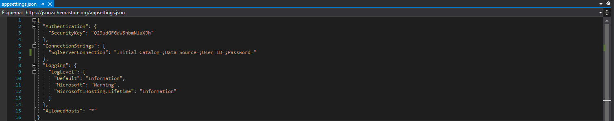

4. Clique em *Ferramentas > Gerenciador de Pacotes do Nuget > Console do Gerenciador de Pacotes*
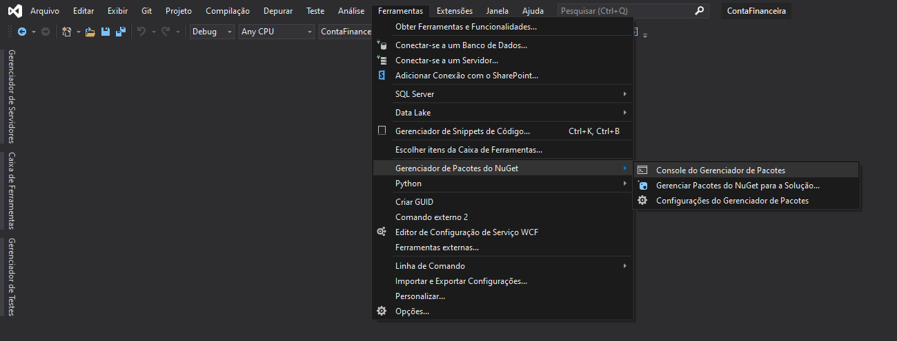

5. Selecione o projeto *ContasFinanceiras.Persistance* para Inicialização
6. Rode o comando *"update-database"* e verifique se o banco de dados foi criado com sucesso
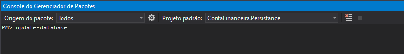

7. Certifique-se que o projeto de inicialização é o *ContasFinanceiras.API* (destacado em negrito). Se estiver, pule para o passo 9
8. Clique com o botão direito do mouse sobre o projeto *ContasFinanceiras.API* e selecione a opção *Definir como Projeto de Inicialização*
9. No botão de iniciar, selecione o projeto *ContasFinanceiras.API*
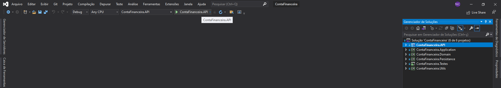

10. Pronto! O navegador deve abrir com o [Swagger para teste](#swagger)
11. Siga o [passo a passo para testar a aplicação](#como-testar-a-aplicação)

## Publicação no IIS

## Docker

# Como testar a aplicação

## Postman
1. Baixe a collection <a id="raw-url" href="https://github.com/Nathy815/ContaFinanceira/tree/master/medias/ContaFinanceira.postman_collection.json">aqui</a>
2. Importe a collection no Postman (versão 2.1)
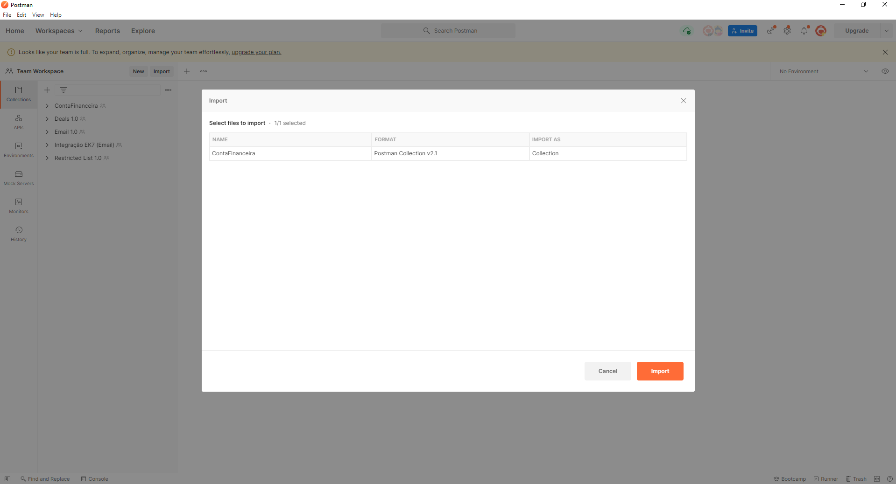

3. Após importada, a coleção aparecerá no menu da esquerda. Basta selecionar a chamada que deseja e clicar em **Send**
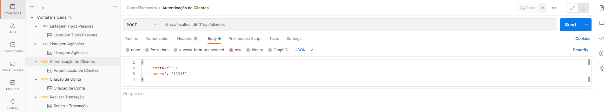

**IMPORTANTE!** 
As rotas estão configuradas para [**Debug com Visual Studio**](#debug-com-visual-studio). Caso opte por outra forma de uso da aplicação, será necessário substituir o servidor https://localhost:5001/ da rota pelo o que você está utilizando. 
Além disso, o token de Authorization na chamada **Realizar Transação** deve ser substituído pelo novo token retornado na chamada **Autenticação de Clientes**.
Leia mais sobre a [**ordem de execução das chamadas**](#order-de-execução-das-chamadas)

## Swagger
1. Seguindo as orientações de [**debug com Visual Studio**](#debug-com-visual-studio), o Swagger abrirá automaticamente. No entanto, caso tenha optado por outra forma de utilização, basta adicionar /swagger na rota em que a aplicação está rodando
2. Uma vez aberto, basta expandir a rota que deseja executar. Em casos de rotas sem parâmetros, clique em Execute. Nas rotas com parâmetros, é necessário preencher o body antes de executar

**IMPORTANTE!**
Siga as instruções de [**ordem de execução das chamadas**](#ordem-de-execução-das-chamadas)
Para execução da chamada /api/transacoes, é necessário adicionar o token na header Authorize. Para isso:
1. Copie **apenas o token** no response de /api/clientes
2. Clique no botão *Authorize* no topo da tela
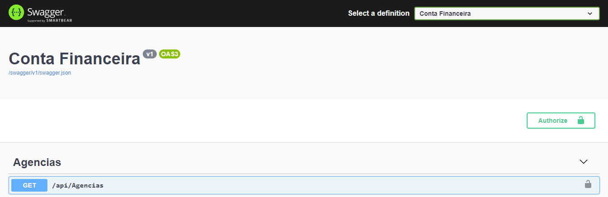

3. Digite "Bearer " (com o espaço na frente), cole o token e clique em *Authorize*
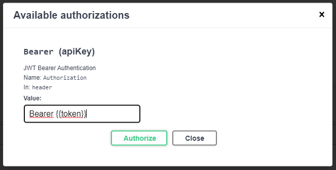
